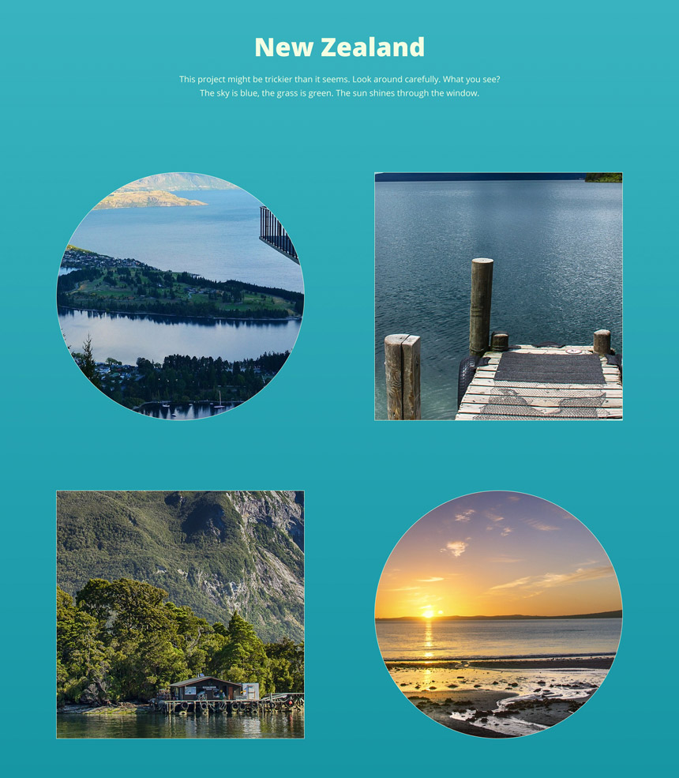

Angular Test Project
======================

## Project brief
Convert the following designs to an Angular app.

### Thumbnails

### Overlay

## Requirements
1. Use BEM with the SCSS syntax for styling.
1. Make it responsive according your best judgement. The 1920px resolution of the design is a reference resolution we compare your conversion to.
1. Create a hover effect for the image thumbnails.
1. Create a simple custom overlay for photos.
1. Create a transition for opening the overlay like shown in this [prototype](https://www.figma.com/proto/XmLxW928QcDblZul5dGpLM/Xfive-Gallery-Test?node-id=1%3A2&viewport=73%2C86%2C0.5&scaling=min-zoom).

## Design
- [Design](https://www.figma.com/file/XmLxW928QcDblZul5dGpLM/Xfive-Gallery-Test) is available in Figma. If you haven't already, sign up for a free Figma account, so you can inspect the design.
- [Prototype](https://www.figma.com/proto/XmLxW928QcDblZul5dGpLM/Xfive-Gallery-Test?node-id=1%3A2&viewport=73%2C86%2C0.5&scaling=min-zoom)

The following images are used in the design:
 - [Image 1](https://pixabay.com/en/new-zealand-lake-mountain-landscape-679068/)
 - [Image 2](https://pixabay.com/en/new-zealand-lake-web-kai-dock-583176/)
 - [Image 3](https://pixabay.com/en/new-zealand-doubtful-sound-fjord-583181/)
 - [Image 4](https://pixabay.com/en/sun-rise-beach-new-zealand-auckland-661541/)

## Supported browsers
Ensure that the app works and displays correctly in the following browsers:

- Google Chrome
- Firefox
- Microsoft Edge

## Project Deadline
Deliver project within 1 week time.

