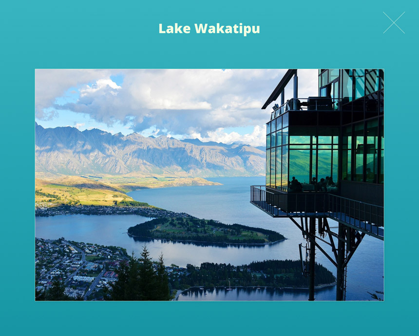

Angular Test Project
======================

## Project brief
Convert the following designs to an Angular app.

### Thumbnails

### Overlay

## Requirements
1. Use BEM with the SCSS syntax for styling.
1. Make it responsive according your best judgement. The 1920px resolution of the design is a reference resolution we compare your conversion to.
1. The images should be loaded from [this external source](https://github.com/xfiveco/mock-api-images) (you can use it as a fake API with [list of images](https://raw.githubusercontent.com/xfiveco/mock-api-images/main/images.json))
1. Create a hover effect for the image thumbnails.
1. Create a simple custom overlay for images. Each image should be reachable by its own URI.
1. Create a transition for opening the overlay like shown in this [prototype](https://www.figma.com/proto/XmLxW928QcDblZul5dGpLM/Xfive-Gallery-Test?node-id=1%3A2&viewport=73%2C86%2C0.5&scaling=min-zoom).

## Design
- [Design](https://www.figma.com/file/XmLxW928QcDblZul5dGpLM/Xfive-Gallery-Test) is available in Figma. If you haven't already, sign up for a free Figma account, so you can inspect the design.
- [Prototype](https://www.figma.com/proto/XmLxW928QcDblZul5dGpLM/Xfive-Gallery-Test?node-id=1%3A2&viewport=73%2C86%2C0.5&scaling=min-zoom)

## Supported browsers
Ensure that the app works and displays correctly in the following browsers:

- Google Chrome
- Firefox
- Microsoft Edge

## Project Deadline
Deliver project within 1 week time.

